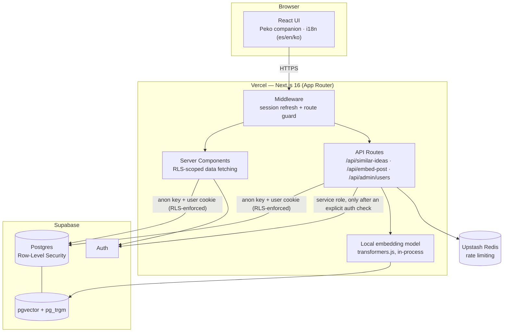

# KOCO Supporters Platform

A trilingual (Spanish / English / Korean) volunteer management platform built for a real cross-cultural cooperation program — replacing a set of shared spreadsheets with a live application that handles content approval workflows, event registration, a gamified points system, and semantic duplicate detection, all behind a role-based, row-level-secured multi-tenant data model.

**[Live demo →](#)** <!-- add your Vercel URL here -->


## Overview

Two very different audiences share one surface: phone-first volunteers submitting content ideas and signing up for events, and desktop-first admins reviewing submissions and tracking participation. The app is built around that split — separate dashboards, separate permissions, one consistent design system — with every screen shipping in three languages from day one.

## Highlights

- **Semantic duplicate detection.** Before submitting a content idea, volunteers get a live check against every existing idea — not just literal text matches (via Postgres trigram similarity) but *meaning*-level matches, computed by embedding every idea with a local multilingual transformer model (`Xenova/multilingual-e5-small`, running server-side via `transformers.js`, no external API calls) and comparing vectors with `pgvector`. Tuned and validated against real production data, not just theory.
- **Row-level security as the actual boundary, not just app-layer checks.** Every table enforces per-user access at the database level — a volunteer's private data (their content, their points) is invisible to other volunteers even if the application code had a bug, because Postgres itself won't return the rows. Verified with live, unauthenticated-client probe tests before shipping, not just assumed correct.
- **A living mascot companion**, not a static illustration — built from a custom image-processing pipeline (AI background removal + connected-component filtering to clean up a hand-drawn character sheet) into a component with its own behavior state machine: idle breathing, randomized autonomous blinking, cursor-tracking, a sleep/wake cycle after inactivity, and event-driven reactions (celebrates on approvals, waves on page arrival) — all CSS-transform-driven for near-zero performance cost, with full `prefers-reduced-motion` support.
- **Durable rate limiting for serverless.** API routes are protected via Upstash Redis-backed sliding-window limits (not an in-memory counter, which silently resets on every cold start in a serverless environment).
- **A real, messy-data migration pipeline.** Historical program data lived in hand-maintained Excel spreadsheets with inconsistent date formats, typo'd category labels, and free-text name fields. Built a fuzzy-matching import pipeline (Python/`openpyxl` parsing → Node diff-and-reconcile against the live database) that inserts only genuinely new rows and flags ambiguous changes for human review, instead of blindly re-importing and risking duplicate data.
- **Trilingual by construction, not by translation layer bolt-on.** Every component carries its own `{es, en, ko}` copy object; locale is a first-class piece of state, not a post-hoc i18n library wrapped around English strings.

## Tech stack

| Layer | Choice |
|---|---|
| Framework | Next.js 16 (App Router), React 19, TypeScript |
| Database / Auth | Supabase (Postgres, Row-Level Security, Auth) |
| Search | pgvector + `pg_trgm`, local embedding inference via `@huggingface/transformers` |
| Rate limiting | Upstash Redis (`@upstash/ratelimit`) |
| Image processing | `sharp`, AI background removal pipeline |
| Styling | Tailwind CSS v4, custom design token system |
| Deployment | Vercel |

## Architecture



**Why it's shaped this way:**
- **RLS is the real boundary, not the API routes.** Server Components and most API calls use the same anon-key + user-cookie client a browser would — Postgres itself decides what comes back. The service-role key (which bypasses RLS entirely) only appears in the two routes that genuinely need it, and only after the route has already verified the caller's identity and permissions in code.
- **The embedding model runs inside the Next.js server process**, not as a separate microservice — no extra infrastructure, no per-call API cost, at the price of a slower first request per cold start while the model loads.
- **Upstash sits outside the request's critical path for correctness** — if it's unconfigured or unreachable, rate limiting fails open rather than taking the app down, since availability matters more than the rate limit for a small trusted user base.

### Project structure

```
web/
├─ app/
│  ├─ (app)/            # authenticated routes — role-aware layout
│  │  ├─ admin/         # admin-only: content review, events, points, users
│  │  ├─ content/       # volunteer content submission + status
│  │  ├─ events/        # event browsing, RSVP, proposals
│  │  ├─ points/        # gamified points ledger
│  │  └─ dashboard/     # role-branched landing page
│  ├─ api/              # server-only routes (rate-limited, auth-checked)
│  └─ auth/             # login, forced password change
├─ components/          # client components (one per feature area)
├─ lib/                 # Supabase clients, i18n, embeddings, rate limiting
├─ scripts/             # one-off data/maintenance scripts (not run by the app)
└─ public/              # brand assets, Peko companion frames
```

### Notable design decisions

- **Auth model**: profiles are decoupled from `auth.users` (a profile can exist before its owner ever logs in — supports pre-seeding an entire volunteer roster and linking accounts as people join). A `SECURITY DEFINER` Postgres function (`is_admin()`) breaks a self-referential RLS recursion that a naive policy design runs into.
- **Two-tier similarity search**: a fast, free trigram check runs on every keystroke-adjacent blur event; a heavier semantic check only fires once there's enough text to be meaningful, and results are informational (never blocking) below a hard-duplicate threshold — tuned against real measured false-positive/false-negative rates in the actual dataset, not a guessed constant.
- **Content workflow as a state machine**: `draft → submitted → in_review → approved → published`, with rejection and rescheduling branches, each transition gated by its own RLS policy rather than trusted to the client.

## Local development

```bash
npm install
npm run dev
```

Requires a `.env.local` with Supabase project credentials (see `.env.local.example` if present, or the environment variable names referenced in `lib/supabase/*`). Database schema and RLS policies live in the project's `migrations/` folder and should be run in order in the Supabase SQL editor before first use.

## License

Private/portfolio project — not licensed for reuse without permission.
